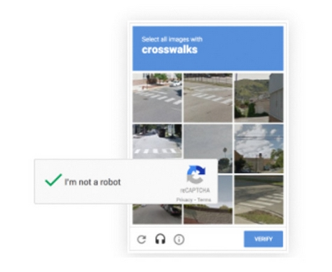
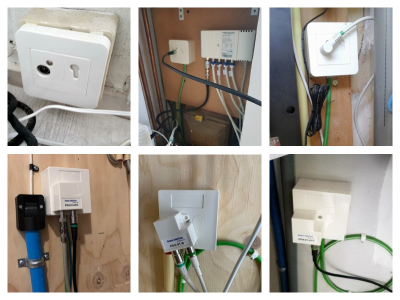

# Few-Shot Object Detection in the ‘Wild’: Detecting Coaxial Cable Splitters, and AOP Wall Socket Plates
\
__‘I’m not a robot’.__ Ever been asked to label crosswalks in your internet browser to verify you are human? Thanks to Google’s reCAPTCHA, many of us have. By proceeding with this security check, you protect websites against cyberattacks, but you also unwittingly contribute to the creation of Google’s annotated image datasets ([Reference](https://support.google.com/recaptcha/answer/6081902?hl=en)). \


Figure. 1.  Google’s reCAPTCHA.
\
\
Popular computer vision algorithms heavily rely on these kind of datasets. Creating them is often time-consuming, and thus costly. Especially, in the case of object detection, and instance/semantic segmentation tasks, where the annotator, next to classifying the object, has to either draw boxes or polygons around the object. Unfortunately, not many companies have access to efficient data collection systems, such as reCAPTCHA. In order for them to build a successful computer vision model with limited resources, they have to be creative. 
\
\
__Case study:__ detecting coaxial cable splitters, and AOP wall socket plates. VodafoneZiggo, a Dutch telecommunications company, is one of these resourceful companies that seek smart, and innovative computer vision solutions for their customers. With an ever-expanding image database, VodafoneZiggo seeks for a method that minimizes annotation time. 
After an extensive literary review, a  few-shot object detection for meta-learning algorithm called ```fsdet``` by Wang et al. was found most suitable to solve this specific task. Hence, the goal of our study is to apply Wang et al.’s model to a real-life VodafoneZiggo dataset with the aim to significantly reduce the number of annotated instances required to detect coaxial cable splitters, and Abonnee Overname Punten (AOPs) (see Figure 2). 
\
\

\
Figure 2. Examples of coaxial cable splitters, and AOP wall socket plates from our custom dataset.

# Tutorial: Few-Shot Object Detection On Custom COCO-Formatted Dataset

## Part 1. Dataset & Virtual Environment
\
__Step 1:__ Create an images dataset, and export the annotations in COCO-format. Make sure your train set instances >= the number of K-shots you want to use for the few-shot model.  
\
Annotation tool (open source): 
+ CVAT ([Reference](https://github.com/openvinotoolkit/cvat))
+ coco-annotator ([Reference](https://github.com/jsbroks/coco-annotator))

Both of these annotation tools require a basic understanding of a software package called Docker. For their ‘Get started’ guide, see <a href="https://www.docker.com/get-started"> Docker Start Guide</a>

\
__Step 2:__ Split your dataset into a train, and test set. A frequently used ratio is 80% for training, and 20% for testing. A COCO-formatted dataset can easily be split via package called [cocosplit](https://github.com/akarazniewicz/cocosplit). 

\
__Step 3__: Create, and activate a conda environment:

```python  
conda create --name fsdet-custom

conda activate fsdet-custom
```

For more information on virtual environments, visit Anaconda's <a href="https://docs.conda.io/projects/conda/en/latest/user-guide/tasks/manage-environments.html"> Managing environments</a> web article.

\
__Step 4:__ Install required Python packages:

To install ```detectron2``` requirements, run following code:

```python  
pip install torch torchvision

python3 -m pip install detectron2 -f 
  https://dl.fbaipublicfiles.com/detectron2/wheels/cu102/torch1.6/index.html
```

Install additional library requirements:

```python  
python3 -m pip install -r requirements.txt
```
\
__Step 5:__ To prepare novel class instances, run:

```python 
python3 dataset/prepare_coco_few_shot.py
```

After you have generated the novel class instances transfer the .json files from the ```seed 1``` folder to the ```dataset``` folder.


## Part 2. Training Your ```fsdet-custom``` Model

\
__Step 1:__ Open the your terminal, and navigate to the ```fsdet-custom``` folder. When you download the package, and store it in your ```home``` folder, you can use the following bash command: 

```console
cd fsdet-custom
```

To ensure the fsdet-custom package is found, type the following command in your terminal: 

```console
export PYTHONPATH=$PYTHONPATH:.
```

For a short introduction on Ubuntu’s command line, visit <a href="https://ubuntu.com/tutorials/command-line-for-beginners#1-overview"> Command Line For Beginners</a>

\
__Step 2:__ To train the base classes, type the following bash command in your terminal: 

```python  
python3 tools/train_net.py --num-gpus 1 \
        --config-file configs/COCO-detection/faster_rcnn_R_101_FPN_base.yaml
```

You can change the  ```--num-gpus``` to the desired number. When you change this parameter, you have to adjust the model configurations files accordingly (e.g. batch size etc.)

\
__Step 3__: For the COCO-formatted dataset, we use novel weights. We first remove the last layer of the base model, then we tune the predictor on the novel set to install new weights. To execute this step, run:

```python  
python3 tools/ckpt_surgery.py \
        --src1 checkpoints/coco/faster_rcnn/faster_rcnn_R_101_FPN_base/model_final.pth \
        --method remove \
        --save-dir checkpoints/coco/faster_rcnn/faster_rcnn_R_101_FPN_all1 \
        --coco
```

```python  
python3 tools/train_net.py --num-gpus 1 \
        --config-file configs/COCO-detection/faster_rcnn_R_101_FPN_ft_novel_1shot.yaml \
        --opts MODEL.WEIGHTS checkpoints/coco/faster_rcnn/faster_rcnn_R_101_FPN_all/model_reset_remove.pth
```

Lastly, we combine the base weights with the novel weights by running the following bash command: 

```python  
python3 tools/ckpt_surgery.py \
        --src1 checkpoints/coco/faster_rcnn/faster_rcnn_R_101_FPN_base/model_final.pth \
        --src2 checkpoints/coco/faster_rcnn/faster_rcnn_R_101_FPN_ft_novel_1shot/model_final.pth \
        --method combine \
        --save-dir checkpoints/coco/faster_rcnn/faster_rcnn_R_101_FPN_all \
        --coco
```

You can train your model on various K-shot settings. To change the number of shots, adjust the command above. For example, if you want to use the 10-shot setting change the following line from ```faster_rcnn_R_101_FPN_ft_novel_1shot``` to ```faster_rcnn_R_101_FPN_ft_novel_10shot```. 

\
__Step 4:__ In this step we fine-tune the last layer of the final model on a balanced dataset. To use the model with the regular ‘dot product’ classifier, execute the following bash command:

```python    
python3 tools/train_net.py --num-gpus 1 \
        --config-file configs/COCO-detection/faster_rcnn_R_101_FPN_ft_fc_all_1shot.yaml \
        --opts MODEL.WEIGHTS checkpoints/coco/faster_rcnn/faster_rcnn_R_101_FPN_all/model_reset_combine.pth
```

Want to use the cosine classifier instead, run:

```python    
python3 tools/train_net.py --num-gpus 1 \
        --config-file configs/COCO-detection/faster_rcnn_R_101_FPN_ft_all_1shot.yaml \
        --opts MODEL.WEIGHTS checkpoints/coco/faster_rcnn/faster_rcnn_R_101_FPN_all/model_reset_combine.pth
```

For a demo of the model with the regular ‘dot product’ classifier, run the following bash command:

```python  
python3 demo/demo.py \
        --config-file configs/COCO-detection/faster_rcnn_R_101_FPN_ft_fc_all_1shot.yaml \
        --input input1.jpg input2.jpg \
        --opts MODEL.WEIGHTS checkpoints/coco/faster_rcnn/faster_rcnn_R_101_FPN_ft_fc_all_1shot/model_final.pth
```

Want to run a demo of the cosine classifier, use:

```python  
python3 demo/demo.py \
        --config-file configs/COCO-detection/faster_rcnn_R_101_FPN_ft_all_1shot.yaml \
        --input input1.jpg input2.jpg \
        --opts MODEL.WEIGHTS checkpoints/coco/faster_rcnn/faster_rcnn_R_101_FPN_ft_all_1shot/model_final.pth
```

For the ```--input``` option insert image names 

\
For attribution, please cite as: 

<div style="padding: 15px; border: 1px solid transparent; border-color: transparent; margin-bottom: 20px; border-radius: 4px; color: #8a6d3b;; background-color: #fcf8e3; border-color: #faebcc;">

@article{Few-Shot Object Detection in the ‘Wild’,  \
&nbsp;&nbsp;&nbsp;&nbsp;&nbsp;title   = "Few-Shot Object Detection in the ‘Wild’: Detecting Coaxial Cable Splitters, and AOP Wall Socket Plates", \
&nbsp;&nbsp;&nbsp;&nbsp;&nbsp;author  = "van Blerck, I.C.E., Rodrigues, W., Wiggers, P.", \
&nbsp;&nbsp;&nbsp;&nbsp;&nbsp;journal = "Insert journal title", \
&nbsp;&nbsp;&nbsp;&nbsp;&nbsp;year    = "2021", \
&nbsp;&nbsp;&nbsp;&nbsp;&nbsp;url = "Insert url" \
}

</div>    


